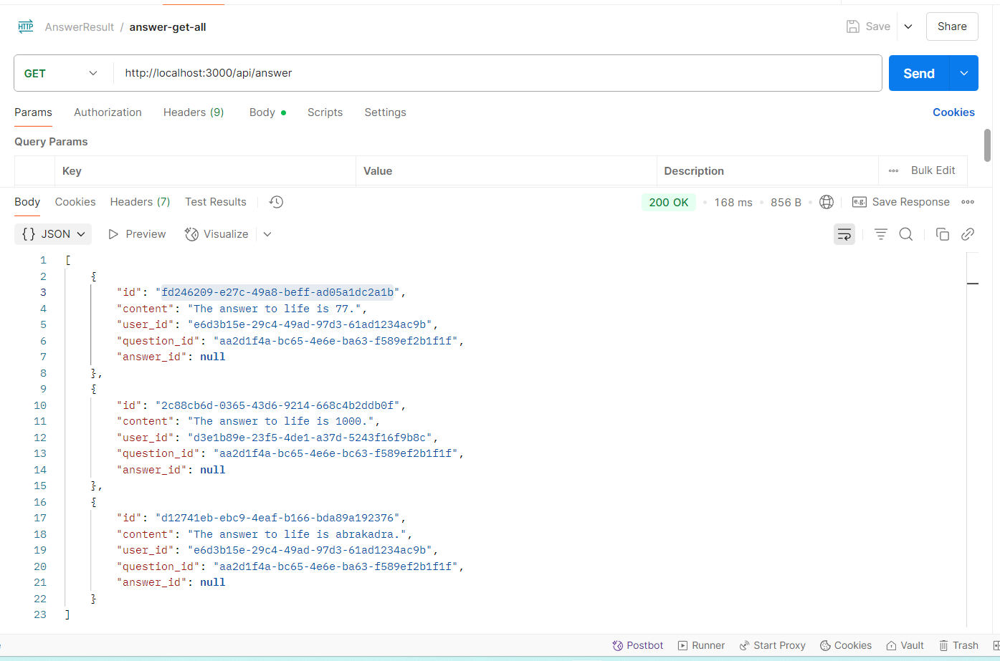
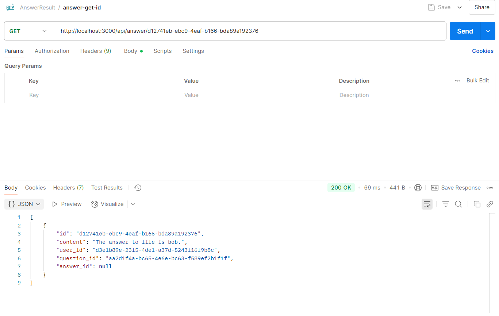
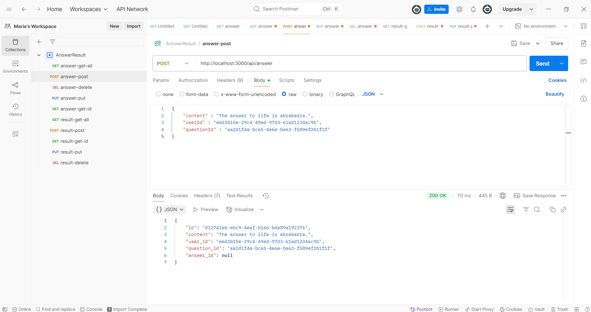
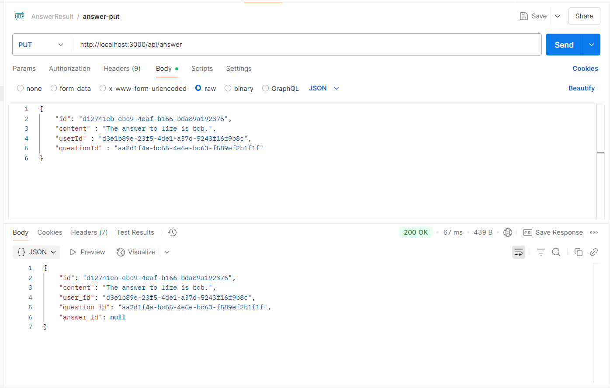
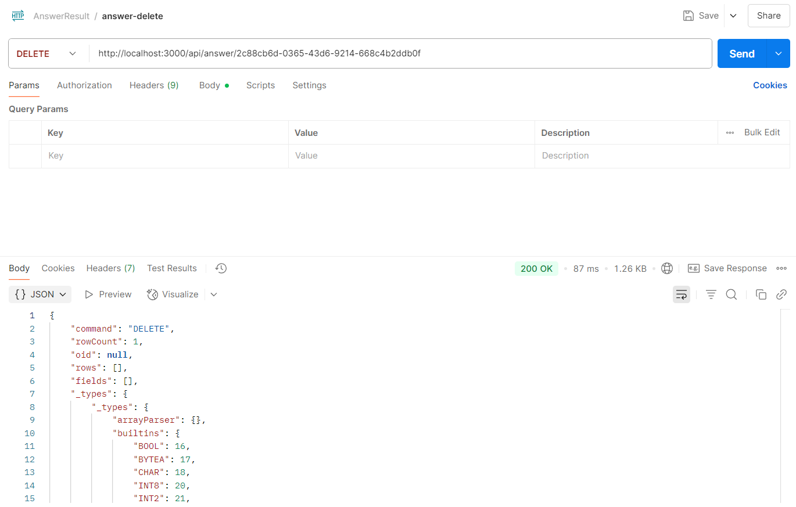
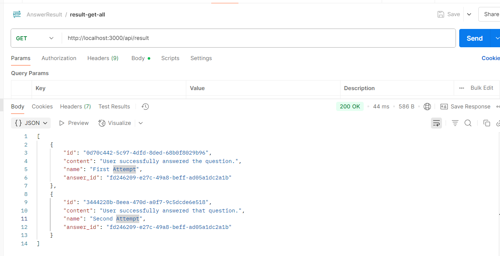
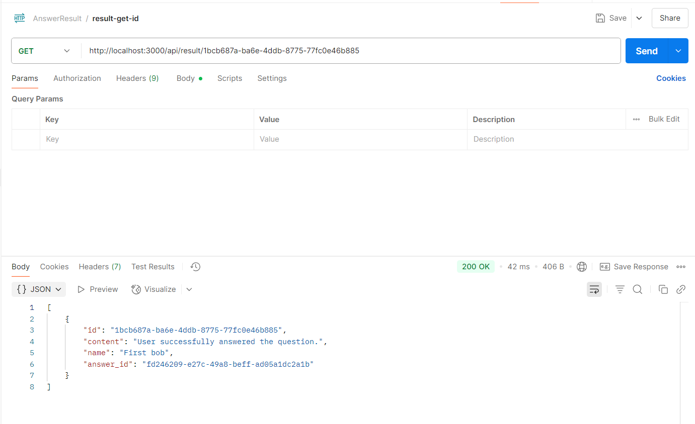
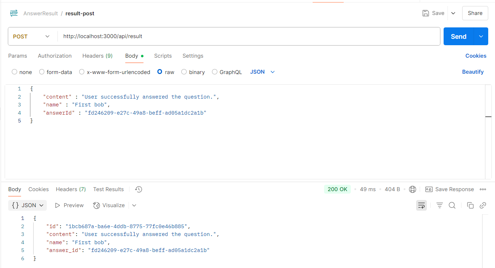
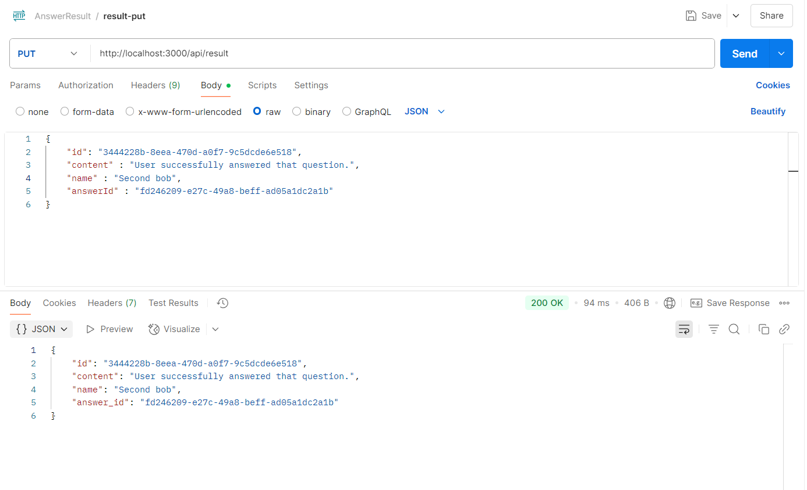
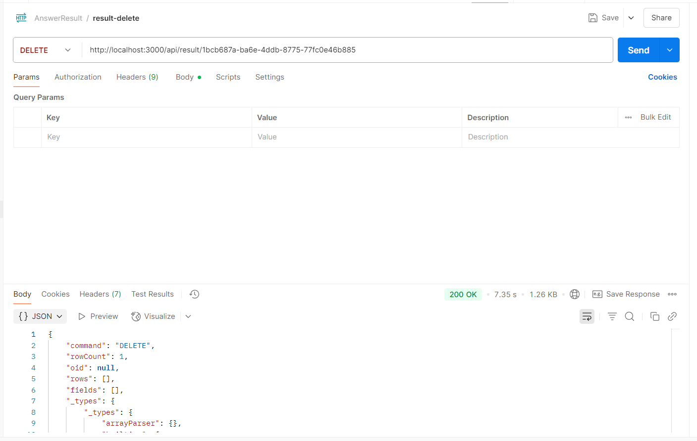

# Тестування працездатності системи

### GET: отримати всі відповідь

### GET: отримати конкретне відповідь

### POST: створити відповідь

### PUT: оновити відповідь

### DELETE: вилучити відповідь

### GET: отримати всі результати

### GET: отримати конкретний результат

### POST: створити результат

### PUT: оновити результат

### DELETE: вилучити результат

