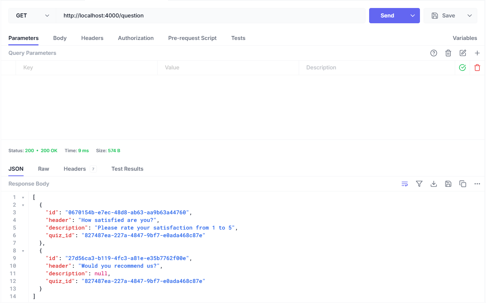
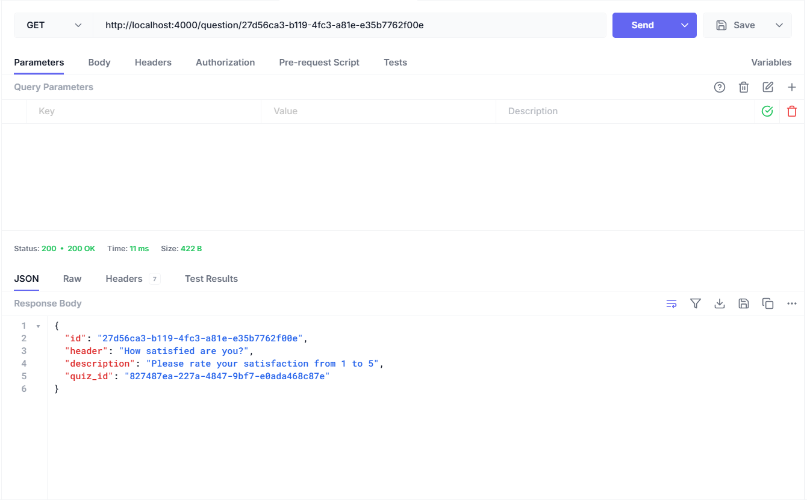
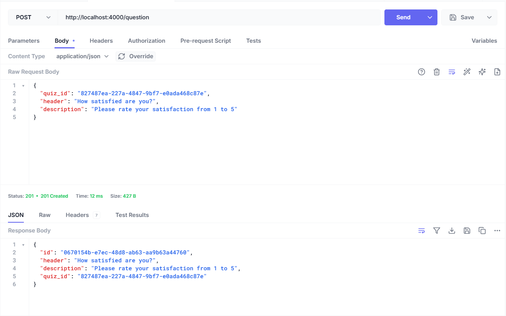
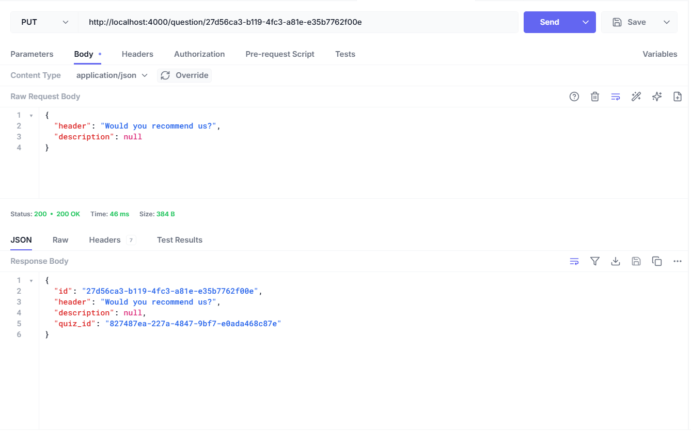
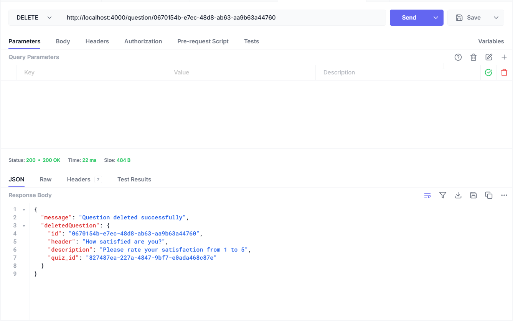
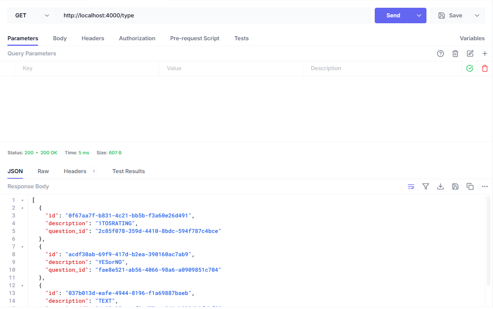
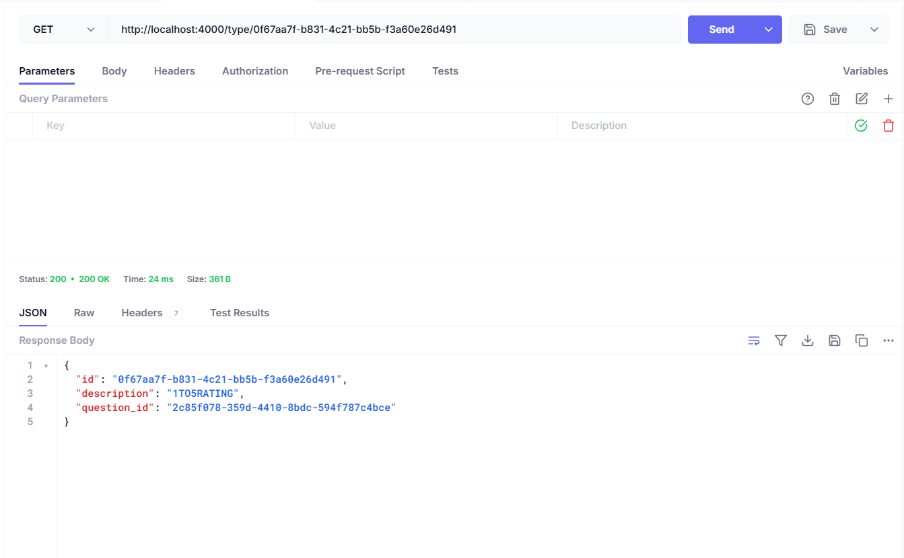
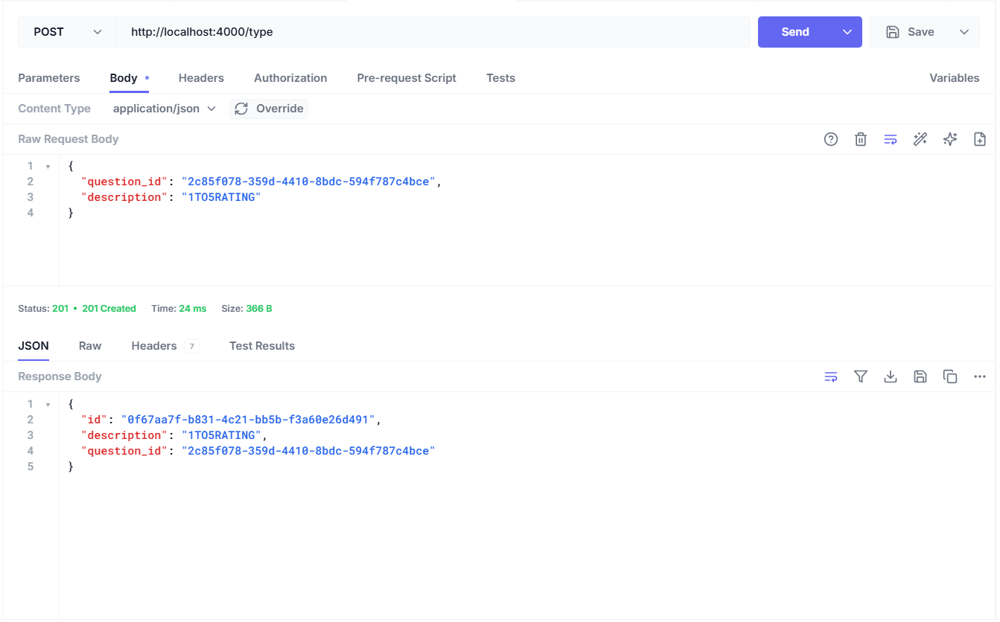
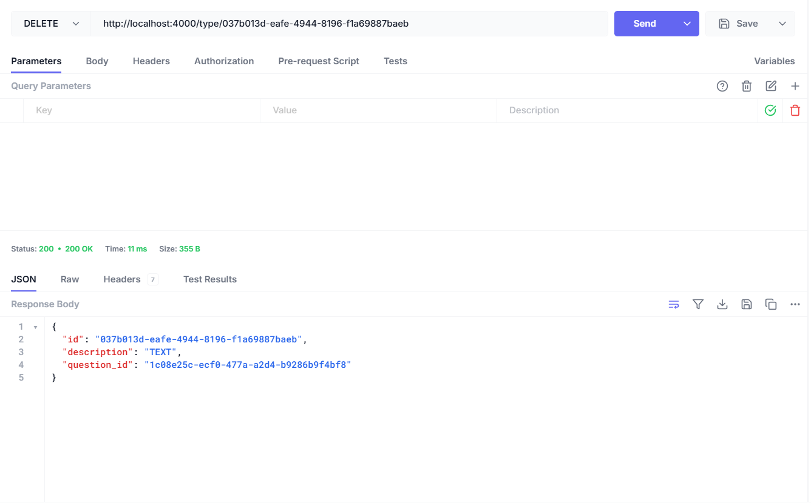

# Тестування працездатності системи

## Передумови

### 1. Встановити залежнсті проекту

```bash
yarn
```

### 2. Запустити сервер

```bash
yarn run start:dev
```

## Перевірка працездатности сервісів

### GET: отримати всі запитання



### GET: отримати конкретне запитання



### POST: створити запитання



### PUT: оновити запитання



### DELETE: вилучити запитання



### GET: отримати всі типи запитаннь



### GET: отримати конкретний тип запитання



### POST: створити тип запитання



### PUT: оновити тип запитання


### DELETE: вилучити тип запитання


