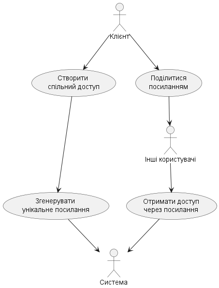

# Модель прецедентів

В цьому файлі необхідно перелічити всі документи, розроблені в проекті та дати посилання на них.

_Модель прецедентів повинна містити загальні оглядові діаграми та специфікації прецедентів._

Вбудовування зображень діаграм здійснюється з використанням сервісу [plantuml.com](https://plantuml.com/).

В markdown-файлі використовується опис діаграми

```html


<center style="
    border-radius:4px;
    border: 1px solid #cfd7e6;
    box-shadow: 0 1px 3px 0 rgba(89,105,129,.05), 0 1px 1px 0 rgba(0,0,0,.025);
    padding: 1em;"
>

@startuml

    right header
        <font size=24 color=black>Package: <b>UCD_3.0
    end header

    title
        <font size=18 color=black>UC_8. Редагувати конфігурацію порталу
        <font size=16 color=black>Діаграма прецедентів
    end title


    actor "Користувач" as User #eeeeaa

    package UCD_1{
        usecase "<b>UC_1</b>\nПереглянути список \nзвітів" as UC_1 #aaeeaa
    }

    usecase "<b>UC_1.1</b>\nЗастосувати фільтр" as UC_1.1
    usecase "<b>UC_1.2</b>\nПереглянути метадані \nзвіту" as UC_1.2
    usecase "<b>UC_1.2.1</b>\nДати оцінку звіту" as UC_1.2.1
    usecase "<b>UC_1.2.2</b>\nПереглянути інформацію \nпро авторів звіту" as UC_1.2.2

    package UCD_1 {
        usecase "<b>UC_4</b>\nВикликати звіт" as UC_4 #aaeeaa
    }

    usecase "<b>UC_1.1.1</b>\n Використати \nпошукові теги" as UC_1.1.1
    usecase "<b>UC_1.1.2</b>\n Використати \nрядок пошуку" as UC_1.1.2
    usecase "<b>UC_1.1.3</b>\n Використати \nавторів" as UC_1.1.3


    User -> UC_1
    UC_1.1 .u.> UC_1 :extends
    UC_1.2 .u.> UC_1 :extends
    UC_4 .d.> UC_1.2 :extends
    UC_1.2 .> UC_1.2 :extends
    UC_1.2.1 .u.> UC_1.2 :extends
    UC_1.2.2 .u.> UC_1.2 :extends
    UC_1 ..> UC_1.2.2 :extends


    UC_1.1.1 -u-|> UC_1.1
    UC_1.1.2 -u-|> UC_1.1
    UC_1.1.3 -u-|> UC_1.1

    right footer
        Аналітичний портал. Модель прецедентів.
        НТУУ КПІ ім.І.Сікорського
        Киів-2020
    end footer

@enduml

**Діаграма прецедентів**

</center>
```

яка буде відображена наступним чином

<center style="
    border-radius:4px;
    border: 1px solid #cfd7e6;
    box-shadow: 0 1px 3px 0 rgba(89,105,129,.05), 0 1px 1px 0 rgba(0,0,0,.025);
    padding: 1em;"
>

@startuml

    right header
        <font size=24 color=black>Package: <b>UCD_3.0
    end header

    title
        <font size=18 color=black>UC_8. Редагувати конфігурацію порталу
        <font size=16 color=black>Діаграма прецедентів
    end title


    actor "Користувач" as User #eeeeaa

    package UCD_1{
        usecase "<b>UC_1</b>\nПереглянути список \nзвітів" as UC_1 #aaeeaa
    }

    usecase "<b>UC_1.1</b>\nЗастосувати фільтр" as UC_1.1
    usecase "<b>UC_1.2</b>\nПереглянути метадані \nзвіту" as UC_1.2
    usecase "<b>UC_1.2.1</b>\nДати оцінку звіту" as UC_1.2.1
    usecase "<b>UC_1.2.2</b>\nПереглянути інформацію \nпро авторів звіту" as UC_1.2.2

    package UCD_1 {
        usecase "<b>UC_4</b>\nВикликати звіт" as UC_4 #aaeeaa
    }

    usecase "<b>UC_1.1.1</b>\n Використати \nпошукові теги" as UC_1.1.1
    usecase "<b>UC_1.1.2</b>\n Використати \nрядок пошуку" as UC_1.1.2
    usecase "<b>UC_1.1.3</b>\n Використати \nавторів" as UC_1.1.3


    User -> UC_1
    UC_1.1 .u.> UC_1 :extends
    UC_1.2 .u.> UC_1 :extends
    UC_4 .d.> UC_1.2 :extends
    UC_1.2 .> UC_1.2 :extends
    UC_1.2.1 .u.> UC_1.2 :extends
    UC_1.2.2 .u.> UC_1.2 :extends
    UC_1 ..> UC_1.2.2 :extends


    UC_1.1.1 -u-|> UC_1.1
    UC_1.1.2 -u-|> UC_1.1
    UC_1.1.3 -u-|> UC_1.1

    right footer
        Аналітичний портал. Модель прецедентів.
        НТУУ КПІ ім.І.Сікорського
        Киів-2020
    end footer

@enduml

**Діаграма прецедентів**

</center>

# Сценарії використання
**SurveyShareAccess**
---
| ID | SurveyShareAccess | 
| :--- | :---: |
| **Назва:** | Надання доступу до опитування |
| **Учасники:** | Користувач, система |
| **Передумови:** | Користувач є автором опитування|
| **Результат:** | Інші користувачі отримують доступ |
| **Виключні ситуації:** |Немає |
| **Основний сценарій:** | 1. Користувач обирає опитування для спільного доступу <br> 2. Система генерує унікальне посилання <br> 3. Посилання надається користувачам, які отримують доступ |
---


<center style="
    border-radius:4px;
    border: 1px solid #cfd7e6;
    box-shadow: 0 1px 3px 0 rgba(89,105,129,.05), 0 1px 1px 0 rgba(0,0,0,.025);
    padding: 1em;">

@startuml

    title
        <font size=18 color=black>UC_2. Спільний доступ до опитування
        <font size=16 color=black>Діаграма комунікацій
    end title

    actor "Клієнт" as Client #eeeeaa
    participant "Система" as System
    participant "Інші користувачі" as OtherUsers

    Client -> System: Обирає опитування для спільного доступу
    System -> System: Генерує унікальне посилання
    System -> Client: Повертає посилання
    Client -> OtherUsers: Ділиться посиланням

    right footer
        Спільний доступ до опитувань. Модель взаємодії.
        НТУУ КПІ ім.І.Сікорського
        Київ-2025
    end footer

@enduml


</center>




**SurveyFeedback**

---
| ID | SurveyFeedback | 
| :--- | :---: |
| **Назва:** | Надання відгуку про опитування |
| **Учасники:** | Користувач, система |
| **Передумови:** | Користувач завершив проходження опитування та має авторизований доступ. |
| **Результат:** | Відгук успішно збережений у системі та доступний адміністрації |
| **Виключні ситуації:** |Відгук не відправлено через технічну помилку або недоступність сервера |
| **Основний сценарій:** | 1. Користувач переглядає підсумки опитування <br> 2. Оцінює якість запитань і надає зворотний зв’язок <br> 3. Система зберігає відгук <br> 4.  Адміністратор може переглянути отримані відгуки в адмін-панелі |
---

<center style="
    border-radius:4px;
    border: 1px solid #cfd7e6;
    box-shadow: 0 1px 3px 0 rgba(89,105,129,.05), 0 1px 1px 0 rgba(0,0,0,.025);
    padding: 1em;">

@startuml
    

    title
        <font size=18 color=black>UC_1. Оцінка та відгуки користувачів
        <font size=16 color=black>Діаграма комунікацій
    end title

    actor "Користувач" as User #eeeeaa
    participant "Система" as System
    participant "Адміністратор" as Admin

    User -> System: Переглядає підсумки опитування
    User -> System: Оцінює якість запитань та надає відгук
    System -> System: Зберігає відгук
    System -> Admin: Відображає відгук в адмін-панелі

    right footer
        Аналіз зворотного зв'язку. Модель взаємодії.
        НТУУ КПІ ім.І.Сікорського
        Київ-2025
    end footer

@enduml


</center>


